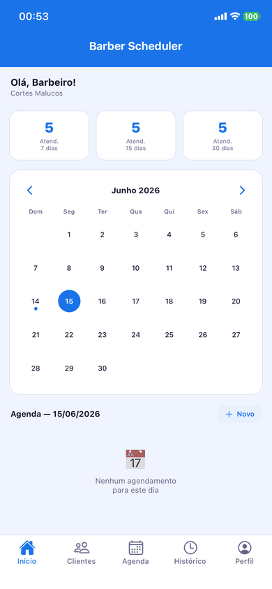

# Barber Scheduler
### Projeto Integrador V–A

> Aplicativo móvel para gerenciamento de clientes, agendamentos e histórico de atendimentos em barbearias — desenvolvido como projeto integrador acadêmico com armazenamento 100% local.

<p align="center">
  
</p>

---

## Sumário

- [Contextualização](#contextualização)
- [Objetivos](#objetivos)
- [Funcionalidades](#funcionalidades)
- [Arquitetura](#arquitetura)
- [Tecnologias](#tecnologias)
- [Estrutura do Projeto](#estrutura-do-projeto)
- [Regras de Negócio](#regras-de-negócio)
- [Instalação e Execução](#instalação-e-execução)
- [Metodologia de Desenvolvimento](#metodologia-de-desenvolvimento)

---

## Contextualização

Barbearias frequentemente recorrem a anotações manuais ou grupos de mensagens para organizar seus atendimentos. Essa abordagem gera conflitos de horários, perda de informações e dificuldade na consulta de históricos de clientes. O **Barber Scheduler** surge como solução centralizada: um aplicativo móvel que substitui o caderno físico sem exigir conectividade ou servidor externo, mantendo todos os dados de forma segura no próprio dispositivo.

---

## Objetivos

- Fornecer ao barbeiro uma ferramenta intuitiva para cadastro e gestão de clientes.
- Automatizar o controle da agenda diária e prevenir conflitos de horários.
- Registrar automaticamente o histórico de atendimentos concluídos.
- Oferecer um painel financeiro simples para acompanhamento de faturamento.
- Demonstrar na prática a aplicação de uma arquitetura em camadas em React Native com TypeScript.

---

## Funcionalidades

### Tela Inicial — Dashboard
- Calendário interativo com navegação por mês; dias com agendamentos são destacados visualmente.
- Painel de indicadores exibindo atendimentos do dia, da semana e do mês.
- Saudação personalizada com nome do barbeiro e da barbearia.
- Lista dos agendamentos do dia selecionado com acesso direto à edição.

### Clientes
- Cadastro, edição, consulta e exclusão de clientes.
- Campos: nome, telefone, e-mail e data de cadastro.
- Exclusão em cascata: remove todos os agendamentos vinculados.

### Agendamentos
- CRUD completo com seleção de cliente, data, hora e serviço.
- Validação de conflito: impede dois agendamentos para o mesmo horário.
- Ações de **concluir**, **cancelar** e **remarcar** diretamente na listagem.
- Ao concluir, o registro é automaticamente enviado ao histórico.

### Histórico
- Listagem de todos os atendimentos concluídos.
- Filtro por cliente para consulta individualizada.

### Perfil
- Cadastro do nome do barbeiro e da barbearia (exibido no dashboard).
- Alternância entre **modo claro** e **modo escuro** com persistência local.
- Painel de faturamento com resumos de 7, 15 e 30 dias.
- Calculadora de faturamento por período personalizado com seleção de datas.

### Splash Screen
- Tela de inicialização animada (fade-in + spring) que aguarda a abertura do banco antes de exibir o app.

---

## Arquitetura

O projeto adota uma arquitetura em três camadas, mantendo separação clara de responsabilidades:

```
┌─────────────────────────────────────────────────────┐
│                    Interface (Screens)               │
│  HomeScreen · ClientesScreen · AgendamentosScreen   │
│  HistoricoScreen · PerfilScreen · SplashScreen       │
└────────────────────┬────────────────────────────────┘
                     │
┌────────────────────▼────────────────────────────────┐
│                  Camada de Serviços                  │
│  clienteService · agendamentoService · historicoService │
│          (regras de negócio e validações)            │
└────────────────────┬────────────────────────────────┘
                     │
┌────────────────────▼────────────────────────────────┐
│              Camada de Persistência (SQLite)         │
│  clienteRepository · agendamentoRepository           │
│  historicoRepository · configuracaoRepository        │
└─────────────────────────────────────────────────────┘
```

**Fluxo de dados:** Usuário → Screen → Service → Repository → SQLite (local)

---

## Tecnologias

| Camada | Tecnologia | Versão |
|---|---|---|
| Framework mobile | React Native + Expo | SDK 54 |
| Linguagem | TypeScript | 5.8 |
| Banco de dados | SQLite local (expo-sqlite) | ~16.0 |
| Navegação | React Navigation (tabs + stack) | 7.x |
| Ícones | @expo/vector-icons (Ionicons) | 15.x |
| Seletor de data | @react-native-community/datetimepicker | 8.4 |
| Tema | Context API com persistência em SQLite | — |

---

## Estrutura do Projeto

```
frontend/
├── App.tsx                          # Ponto de entrada: inicializa DB, tema e SplashScreen
├── app.json                         # Configurações Expo (ícone, splash, orientação)
└── src/
    ├── types/
    │   └── index.ts                 # Interfaces: Cliente, Agendamento, Historico
    ├── theme/
    │   └── ThemeContext.tsx         # Context de tema claro/escuro com persistência
    ├── database/
    │   ├── database.ts              # Inicialização e criação das tabelas SQLite
    │   ├── clienteRepository.ts     # CRUD de clientes
    │   ├── agendamentoRepository.ts # CRUD de agendamentos
    │   ├── historicoRepository.ts   # Consultas de histórico e cálculo de faturamento
    │   └── configuracaoRepository.ts# Persistência de configurações (perfil, tema)
    ├── services/
    │   ├── clienteService.ts        # Validação e orquestração de clientes
    │   ├── agendamentoService.ts    # Conflito de horários, conclusão → histórico
    │   └── historicoService.ts      # Filtros e consultas de histórico
    ├── navigation/
    │   └── AppNavigator.tsx         # Bottom tabs + Native Stack por aba
    └── screens/
        ├── SplashScreen.tsx         # Tela animada de inicialização
        ├── HomeScreen.tsx           # Dashboard + calendário interativo
        ├── ClientesScreen.tsx       # Listagem de clientes
        ├── ClienteFormScreen.tsx    # Formulário de cadastro/edição
        ├── AgendamentosScreen.tsx   # Listagem de agendamentos
        ├── AgendamentoFormScreen.tsx# Formulário de agendamento
        ├── HistoricoScreen.tsx      # Histórico com filtro por cliente
        └── PerfilScreen.tsx         # Perfil, tema e painel financeiro
```

---

## Regras de Negócio

| # | Regra |
|---|---|
| RN01 | Um agendamento com status `agendado` não pode ocupar um horário já reservado. |
| RN02 | Todo agendamento deve estar vinculado a um cliente cadastrado. |
| RN03 | Ao marcar um agendamento como **concluído**, um registro de histórico é criado automaticamente. |
| RN04 | A exclusão de um cliente remove em cascata todos os seus agendamentos. |
| RN05 | Atendimentos com status `concluído` ou `cancelado` não aparecem na agenda do dia. |
| RN06 | O cálculo de faturamento considera apenas serviços com valor definido no histórico. |
| RN07 | A preferência de tema (claro/escuro) e os dados de perfil são persistidos localmente. |

---

## Instalação e Execução

### Pré-requisitos

- [Node.js](https://nodejs.org) 18 ou superior
- Expo Go instalado no celular ([Android](https://play.google.com/store/apps/details?id=host.exp.exponent) / [iOS](https://apps.apple.com/app/expo-go/id982107779))

### Instalação

```bash
cd frontend
npm install
```

### Executando

```bash
npm start
```

O Expo abrirá um QR Code no terminal. Opções de execução:

| Comando | Plataforma |
|---|---|
| Escanear QR Code com Expo Go | Dispositivo físico (Android/iOS) |
| Pressionar `a` | Emulador Android |
| Pressionar `i` | Simulador iOS (requer macOS + Xcode) |
| Pressionar `w` | Navegador web |

> **Nota:** O app usa `expo start --tunnel` por padrão, permitindo testar em redes diferentes.

---

## Metodologia de Desenvolvimento

O projeto foi desenvolvido seguindo os princípios da **Extreme Programming (XP)**, com entregas incrementais organizadas em iterações:

| Iteração | Entregas |
|---|---|
| 1 | Configuração do projeto, banco SQLite, CRUD de clientes |
| 2 | CRUD de agendamentos, validação de conflito de horários |
| 3 | Histórico de atendimentos, Splash Screen animada |
| 4 | Tela de Perfil, sistema de tema claro/escuro, dashboard financeiro |

Práticas aplicadas: planejamento incremental, desenvolvimento orientado a funcionalidades, refatoração contínua e código simples e organizado.
